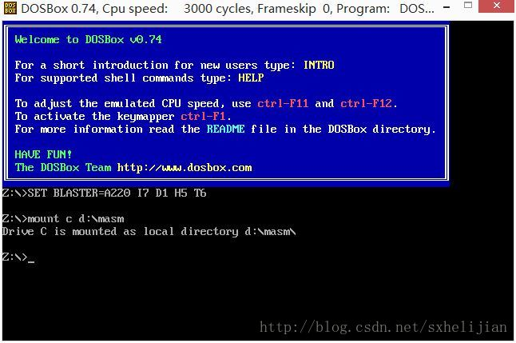

# 8086 Assembly Development Environment

Please read the original text of this blog post: "[搭建x86汇编语言学习环境](http://blog.csdn.net/sxhelijian/article/details/54845039)"

## 💡 What's on My Mind

He was an outstanding educator who taught me a great deal during my undergraduate studies. His instruction extended beyond imparting knowledge, and more importantly, he instilled in me the methods of learning itself.

This repository was compiled by me from the materials provided by my instructor and is intended to serve as a centralized collection of resources. If you were unable to retain or need to access these materials, this repository exists for that very purpose.

Hope that this repository can be of assistance to every aspiring open-source enthusiast, including fellow students and peers.

## 🚀 Getting Started

To get started with this repository, follow these steps:

1. Clone the repository:

```shell
$ git clone https://github.com/ChHsiching/8086-Assembly-DevEnv.git
```

2. Read the Tutorial Below and Follow Along

## 📝 Blog Post Forward

> Fwd: [搭建x86汇编语言学习环境](http://blog.csdn.net/sxhelijian/article/details/54845039)

### Designing an Instruction Set Architecture (ISA) Teaching Plan: A Start with 8086 Assembly 

When it comes to teaching assembly languages, attention must be focused on understanding the underlying system. With numerous instructions to learn, beginners can easily become overwhelmed. In this context, designing a simplified instructional model that distills the essential concepts is crucial for gaining entry-level proficiency. 

The venerable 8086 assembly language, although aging, remains an ideal teaching model in today's technological landscape. Students' future work may rely on 80x86-based systems, which can be extended to Linux assembly or ARM assembly based on a solid foundation in 8086 assembly. Moreover, learning assembly languages can foster a deeper understanding of computer architectures, making 8086 assembly well-suited for the task.

The next challenge lies in setting up an assembly program design environment. 

As the foundation stage for teaching assembly languages, we will focus on the classic DOS environment, utilizing `MASM` (Microsoft Macro Assembler) and `LINK` (linker) to compile code. Additionally, `DEBUG` (debugger) will be employed for testing purposes. 

However, a new hurdle arises when working in Windows 8 environments, where DOS commands are no longer supported. 

A straightforward solution is to download an 8086 assembly development environment that provides a DOS emulator (DOSBox) and a set of practical commands for designing assembly programs. Upon extraction, the file folder structure will resemble: 


- The `DOSBox` installer (`DOSBox0.74-win32-installer.exe`) for installing the DOS emulator;
- The MASM file folder containing essential tools for 8086 assembly program design, including `masm.exe`, `link.exe`, `Debug.exe`, `edit.com`, and `edlin.com`;
- A sample programs folder providing a few examples of assembled code.

To complete the environment setup, follow these steps:

1. Copy the MASM file folder to your working drive (e.g., D:\MASM).

    

2. Install `DOSBox` by double-clicking on the installer and following the prompts.

    

3. Launch `DOSBox` by double-clicking on the icon that appears on your desktop after installation.

    

4. Attach the MASM file folder to the C drive in `DOSBox` by typing "`mount c d:\masm`" at the `Z:>` prompt.

    
     
> Note: The `d:\masm` directory is the working directory copied in step 1, so adjust accordingly based on your actual settings. 

The final result should resemble: 
- A directory listing (`dir`) showing a structure similar to that of the original file system;
- A prompt indicating that you are now working in `C:`.

From this point forward, only steps 3 and 4 will be necessary. 

## 📜 License

This repository is based on an original article titled '[搭建x86汇编语言学习环境](https://blog.csdn.net/sxhelijian/article/details/54845039)' by [贺利坚](https://helijian.blog.csdn.net/?type=blog), which has been republished under the terms of the [CC-BY-4.0]((https://creativecommons.org/licenses/by/4.0/)) license and is available at https://blog.csdn.net/sxhelijian/article/details/54845039.